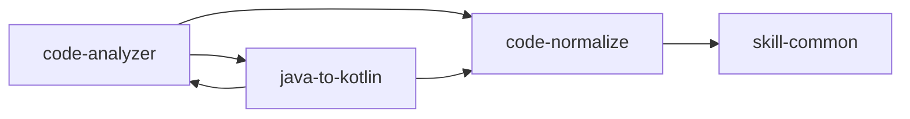

# Codex Skills

个人 Codex Skills 合集，统一管理、统一发布。

## Skills 列表

| Skill | 用途 | 依赖 |
|---|---|---|
| [android-cli](./android-cli/) | Android 开发任务编排（项目创建、部署、SDK 管理、环境诊断） | 无 |
| [code-analyzer](./code-analyzer/) | Java/Kotlin 代码分析：梳理方法逻辑、添加中文注释、检测 bug、性能分析 | code-normalize, java-to-kotlin |
| [code-normalize](./code-normalize/) | Java/Kotlin 成员变量命名规范化、类注释补充、关键成员注释 | skill-common |
| [java-to-kotlin](./java-to-kotlin/) | Android 项目 Java 转 Kotlin（扫描调用方→分析→转换→删除→编译验证） | code-analyzer, code-normalize |
| [skill-common](./skill-common/) | 个人 Skill 基础规范（中文输出、职责路由、持续进化） | 无 |

## 依赖关系

## 使用方式

将本仓库 clone 到 `~/.codex/skills/` 目录下，或通过 Codex 的 `$github-manager` 技能安装。

## 管理

通过 `$github-manager` 技能统一管理发布和更新：
- 安全扫描：检测敏感信息
- 变更检测：基于 SHA256 hash 对比
- 增量发布：仅更新有改动的 skill
- 文档生成：自动维护目录文档

## GitHub 账号

[xjxlx](https://github.com/xjxlx)
