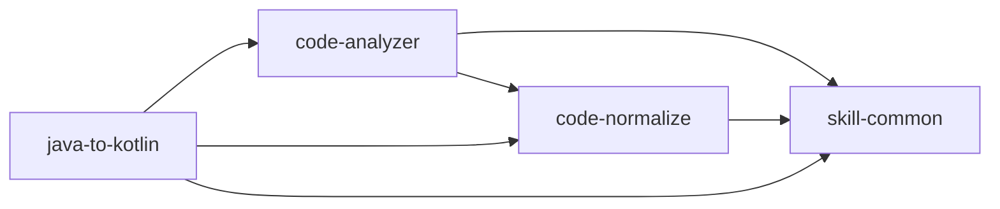

# 个人 Skills 目录

> 自动生成于 2026-06-15 14:39:49，由 github-manager 维护
> GitHub 账号：xjxlx

## 概览

| Skill | 用途 | 依赖 | 状态 | 最后更新 |
|---|---|---|---|---|
| [code-analyzer](https://github.com/xjxlx/codex-skills/tree/main/code-analyzer) | 为指定 Java、Kotlin 文件梳理方法逻辑，添加详细中文方法注释，检测潜在 bug 和性能复杂度问题，并调用 code-normalize 完成成员... | code-normalize, skill-common | 已发布 | 2026-06-15 |
| [code-normalize](https://github.com/xjxlx/codex-skills/tree/main/code-normalize) | 检测并安全规范 Java、Kotlin 类中的成员变量命名，更新全部引用，补充缺失的类注释，并为关键成员添加作用说明。当用户要求检查或重构 bname、a... | skill-common | 已发布 | 2026-06-15 |
| [github-manager](https://github.com/xjxlx/codex-skills/tree/main/github-manager) | 实现个人 Codex Skills 的变更检测、凭据扫描、GitHub 发布、目录维护和本地恢复。当用户要求检查发布状态、发布或更新 skill、扫描敏感... | 无 | 已发布 | 2026-06-15 |
| [java-to-kotlin](https://github.com/xjxlx/codex-skills/tree/main/java-to-kotlin) | 将 Android 项目中的 Java 类转换为 Kotlin。用于将 Java 文件迁移到 Kotlin、用惯用 Kotlin 重写 Java 类、或现... | code-analyzer, code-normalize, skill-common | 已发布 | 2026-06-15 |
| [skill-common](https://github.com/xjxlx/codex-skills/tree/main/skill-common) | 作为个人 Skill 的强制基础规范，统一启动时变更检测与自动发布、中文输出、职责路由、依赖去重和持续进化。除明确声明例外的 Skill 外，每个个人 S... | 无 | 已发布 | 2026-06-15 |

## 依赖关系

## 各 Skill 详情

### code-analyzer

- **目录名**：`code-analyzer`
- **用途**：为指定 Java、Kotlin 文件梳理方法逻辑，添加详细中文方法注释，检测潜在 bug 和性能复杂度问题，并调用 code-normalize 完成成员...
- **依赖**：code-normalize, skill-common
- **文件数**：3
- **UI 元数据**：缺少
- **路径**：`~/.codex/skills/code-analyzer/`
- **仓库**：https://github.com/xjxlx/codex-skills/tree/main/code-analyzer
- **状态**：已发布
- **最后更新**：2026-06-15

### code-normalize

- **目录名**：`code-normalize`
- **用途**：检测并安全规范 Java、Kotlin 类中的成员变量命名，更新全部引用，补充缺失的类注释，并为关键成员添加作用说明。当用户要求检查或重构 bname、a...
- **依赖**：skill-common
- **文件数**：5
- **UI 元数据**：有 agents/openai.yaml
- **路径**：`~/.codex/skills/code-normalize/`
- **仓库**：https://github.com/xjxlx/codex-skills/tree/main/code-normalize
- **状态**：已发布
- **最后更新**：2026-06-15

### github-manager

- **目录名**：`github-manager`
- **用途**：实现个人 Codex Skills 的变更检测、凭据扫描、GitHub 发布、目录维护和本地恢复。当用户要求检查发布状态、发布或更新 skill、扫描敏感...
- **依赖**：无
- **文件数**：24
- **UI 元数据**：有 agents/openai.yaml
- **路径**：`~/.codex/skills/github-manager/`
- **仓库**：https://github.com/xjxlx/codex-skills/tree/main/github-manager
- **状态**：已发布
- **最后更新**：2026-06-15

### java-to-kotlin

- **目录名**：`java-to-kotlin`
- **用途**：将 Android 项目中的 Java 类转换为 Kotlin。用于将 Java 文件迁移到 Kotlin、用惯用 Kotlin 重写 Java 类、或现...
- **依赖**：code-analyzer, code-normalize, skill-common
- **文件数**：5
- **UI 元数据**：有 agents/openai.yaml
- **路径**：`~/.codex/skills/java-to-kotlin/`
- **仓库**：https://github.com/xjxlx/codex-skills/tree/main/java-to-kotlin
- **状态**：已发布
- **最后更新**：2026-06-15

### skill-common

- **目录名**：`skill-common`
- **用途**：作为个人 Skill 的强制基础规范，统一启动时变更检测与自动发布、中文输出、职责路由、依赖去重和持续进化。除明确声明例外的 Skill 外，每个个人 S...
- **依赖**：无
- **文件数**：5
- **UI 元数据**：有 agents/openai.yaml
- **路径**：`~/.codex/skills/skill-common/`
- **仓库**：https://github.com/xjxlx/codex-skills/tree/main/skill-common
- **状态**：已发布
- **最后更新**：2026-06-15

---

共 **5** 个 skill，其中 **5** 个已发布，**0** 个未发布。
