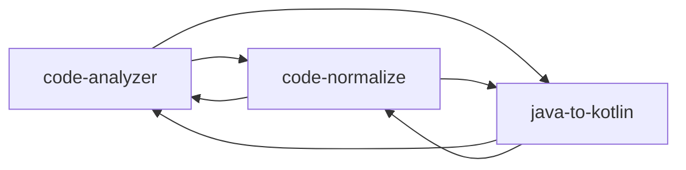

# 个人 Skills 目录

> 自动生成于 2026-06-15 00:01:23，由 github-manager 维护
> GitHub 账号：xjxlx

## 概览

| Skill | 用途 | 依赖 | 状态 | 最后更新 |
|---|---|---|---|---|
| android-cli | Orchestrates Android development tasks including project creation, deployment... | 无 | 已发布 | 2026-06-14 |
| code-analyzer | 为指定 Java、Kotlin 文件梳理方法逻辑，添加详细中文方法注释，检测潜在 bug 和性能复杂度问题，并调用 code-normalize 完成成员... | code-normalize, java-to-kotlin | 已发布 | 2026-06-14 |
| code-normalize | 检测并安全规范 Java、Kotlin 类中的成员变量命名，更新全部引用，补充缺失的类注释，并为关键成员添加作用说明。当用户要求检查或重构 bname、a... | code-analyzer, java-to-kotlin | 已发布 | 2026-06-14 |
| java-to-kotlin | 将 Android 项目中的 Java 类转换为 Kotlin。用于将 Java 文件迁移到 Kotlin、用惯用 Kotlin 重写 Java 类、或现... | code-analyzer, code-normalize | 已发布 | 2026-06-14 |
| skill-common | 作为个人 Skill 的基础规范，统一中文输出、职责唯一路由、依赖去重和持续进化；同时基于真实执行记录、错误、遗漏与验证结果安全更新目标 Skill，并通... | 无 | 已发布 | 2026-06-14 |

## 依赖关系

## 各 Skill 详情

### android-cli

- **目录名**：`android-cli`
- **用途**：Orchestrates Android development tasks including project creation, deployment...
- **依赖**：无
- **文件数**：4
- **UI 元数据**：缺少
- **路径**：`~/.codex/skills/android-cli/`
- **仓库**：https://github.com/xjxlx/codex-skill-android-cli
- **状态**：已发布
- **最后更新**：2026-06-14

### code-analyzer

- **目录名**：`code-analyzer`
- **用途**：为指定 Java、Kotlin 文件梳理方法逻辑，添加详细中文方法注释，检测潜在 bug 和性能复杂度问题，并调用 code-normalize 完成成员...
- **依赖**：code-normalize, java-to-kotlin
- **文件数**：2
- **UI 元数据**：缺少
- **路径**：`~/.codex/skills/code-analyzer/`
- **仓库**：https://github.com/xjxlx/codex-skill-code-analyzer
- **状态**：已发布
- **最后更新**：2026-06-14

### code-normalize

- **目录名**：`code-normalize`
- **用途**：检测并安全规范 Java、Kotlin 类中的成员变量命名，更新全部引用，补充缺失的类注释，并为关键成员添加作用说明。当用户要求检查或重构 bname、a...
- **依赖**：code-analyzer, java-to-kotlin
- **文件数**：4
- **UI 元数据**：有 agents/openai.yaml
- **路径**：`~/.codex/skills/code-normalize/`
- **仓库**：https://github.com/xjxlx/codex-skill-code-normalize
- **状态**：已发布
- **最后更新**：2026-06-14

### java-to-kotlin

- **目录名**：`java-to-kotlin`
- **用途**：将 Android 项目中的 Java 类转换为 Kotlin。用于将 Java 文件迁移到 Kotlin、用惯用 Kotlin 重写 Java 类、或现...
- **依赖**：code-analyzer, code-normalize
- **文件数**：5
- **UI 元数据**：有 agents/openai.yaml
- **路径**：`~/.codex/skills/java-to-kotlin/`
- **仓库**：https://github.com/xjxlx/codex-skill-java-to-kotlin
- **状态**：已发布
- **最后更新**：2026-06-14

### skill-common

- **目录名**：`skill-common`
- **用途**：作为个人 Skill 的基础规范，统一中文输出、职责唯一路由、依赖去重和持续进化；同时基于真实执行记录、错误、遗漏与验证结果安全更新目标 Skill，并通...
- **依赖**：无
- **文件数**：4
- **UI 元数据**：有 agents/openai.yaml
- **路径**：`~/.codex/skills/skill-common/`
- **仓库**：https://github.com/xjxlx/codex-skill-skill-common
- **状态**：已发布
- **最后更新**：2026-06-14

---

共 **5** 个 skill，其中 **5** 个已发布，**0** 个未发布。