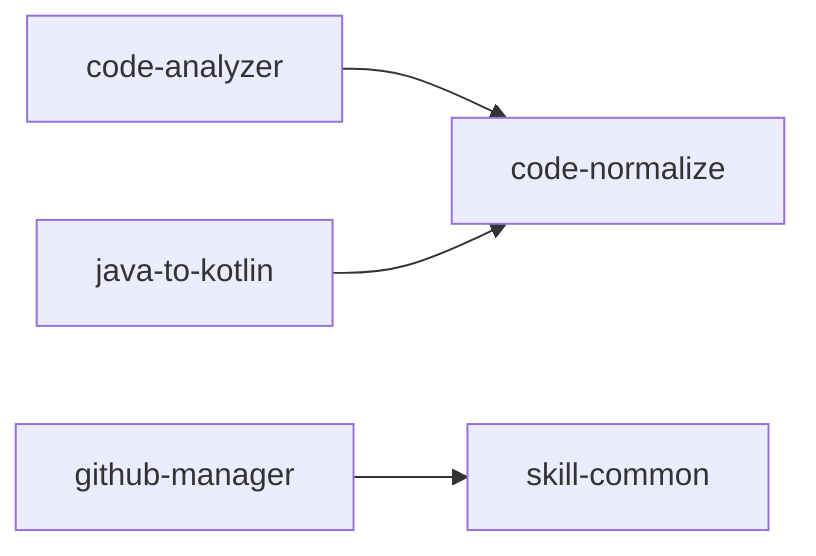

# GitHub Manager

管理个人 Skills 的 GitHub 发布、更新和安全扫描。

引用 `$skill-common` 基础规范，遵循中文优先、职责唯一原则。

## 目录

- 扫描目标：`~/.codex/skills/` 下除 `.system/` 和 `android-cli` 之外的个人 skill
- 发布目标：GitHub 公开仓库（每个 skill 独立仓库或统一仓库）
- Hash 存储：`~/.codex/skills/github-manager/.hashes.json`

## 工作流程

### 第一步：安全扫描

对所有目标 skill 执行安全扫描，检测敏感信息。

**扫描范围**：每个目标 skill 目录下的所有文件（排除 `.git/`、`node_modules/`、`__pycache__/`）。

**检测模式**：

| 类别 | 模式示例 |
|---|---|
| API Key | `api_key=`、`API_KEY=`、`apikey=`、`apiKey` |
| Token | `token=`、`TOKEN=`、`access_token`、`refresh_token`、`bearer` |
| 密码 | `password=`、`PASSWORD=`、`passwd=`、`secret=`、`SECRET=` |
| 私钥 | `-----BEGIN.*PRIVATE KEY-----`、`-----BEGIN RSA-----` |
| 连接串 | `jdbc:`、`mongodb+srv://`、`redis://`、`amqp://` |
| AWS | `AKIA[0-9A-Z]{16}`、`aws_secret_access_key` |
| GitHub Token | `ghp_[A-Za-z0-9]{36}`、`gho_`、`github_pat_` |
| 其他 | Base64 编码的长字符串（>100 字符）、硬编码 IP + 端口 |

**执行方式**：运行 `scripts/scan_credentials.sh <skill_dir>` 扫描单个 skill，或 `scripts/scan_all.sh` 扫描全部。

**处理逻辑**：

- 扫描通过 → 进入第二步
- 扫描发现疑似敏感信息 → **立即暂停**，输出发现清单（文件路径、行号、匹配内容摘要），等待用户逐一确认：
  - 用户确认是误报 → 记录到 `.allowlist` 文件，继续
  - 用户确认是真实敏感信息 → 中止发布，提示用户清理后重试

### 第二步：检测发布状态

检查每个 skill 是否已发布到 GitHub。

**判断方式**：

1. 检查 skill 目录下是否存在 `.github-published` 标记文件
2. 标记文件内容为 JSON：`{"repo": "owner/repo", "last_publish": "ISO8601", "commit": "sha"}`
3. 无标记文件 = 未发布，有标记文件 = 已发布

### 第三步：首次发布

对未发布的 skill 执行首次发布。

**流程**：

1. 在 skill 目录初始化 git 仓库（如尚未初始化）
2. 确保 SKILL.md 的 frontmatter 包含准确的 `name` 和 `description`
3. 创建 `README.md`（从 SKILL.md 生成，包含用途、依赖、使用说明）
4. 在 GitHub 创建公开仓库：`codex-skill-{name}`
5. 推送全部内容
6. 写入 `.github-published` 标记文件

**发布信息输出**：

```text
📦 首次发布：{skill_name}
   仓库：https://github.com/{owner}/{repo}
   文件数：{count}
   包含：SKILL.md, scripts/*, references/*, README.md
```

### 第四步：变更检测与更新

对已发布的 skill 检测变更并更新。

**Hash 检测机制**：

1. 读取 `.hashes.json` 中该 skill 的上次 hash 记录
2. 计算当前 skill 目录下所有文件的 SHA256（排除 `.git/`、`.github-published`、`.hashes.json`）
3. 对比 hash：
   - 无变化 → 跳过，输出 `⏭️ {skill_name}：无变更，跳过`
   - 有变化 → 列出变更文件，进入更新流程

**更新流程**：

1. 列出新增、修改、删除的文件
2. 更新 README.md（如有必要）
3. 提交并推送到 GitHub
4. 更新 `.hashes.json` 中该 skill 的 hash 记录
5. 更新 `.github-published` 中的 `last_publish` 和 `commit`

**更新信息输出**：

```text
🔄 更新发布：{skill_name}
   变更文件：
     M  SKILL.md
     A  scripts/new_script.sh
     D  references/old_ref.md
   提交：{commit_sha}
   仓库：https://github.com/{owner}/{repo}
```

### 第五步：生成文档目录

每次发布或更新后，生成/更新两处文档：

**1. 本地文档** `~/.codex/skills/github-manager/SKILLS_CATALOG.md`：

```markdown
# 个人 Skills 目录

> 自动生成于 {date}，由 github-manager 维护

| Skill | 用途 | 依赖 | 仓库 | 状态 |
|---|---|---|---|---|
| code-analyzer | 代码分析与注释 | code-normalize | [链接] | ✅ 已发布 |
| ... | ... | ... | ... | ... |

## 依赖关系



## 各 Skill 详情

### code-analyzer
- **用途**：...
- **依赖**：无
- **路径**：`~/.codex/skills/code-analyzer/`
- **仓库**：https://github.com/...
- **最后更新**：...
```

**2. GitHub 主仓库文档**（如使用统一仓库模式）：同步更新。

## 依赖关系推断

从每个 skill 的 SKILL.md 中提取 `$skill-name` 引用，构建依赖图。常见依赖：

| Skill | 引用 |
|---|---|
| code-analyzer | code-normalize |
| java-to-kotlin | 无明确引用 |
| code-normalize | skill-common |
| github-manager | skill-common |

## 脚本清单

| 脚本 | 用途 |
|---|---|
| `scripts/scan_credentials.sh` | 扫描单个 skill 目录的敏感信息 |
| `scripts/scan_all.sh` | 扫描所有目标 skill |
| `scripts/compute_hashes.sh` | 计算 skill 目录的 SHA256 hash |
| `scripts/detect_changes.sh` | 对比 hash 检测变更 |
| `scripts/publish_skill.sh` | 首次发布 skill 到 GitHub |
| `scripts/update_skill.sh` | 更新已发布 skill |
| `scripts/generate_catalog.sh` | 生成 SKILLS_CATALOG.md |
| `scripts/restore_skills.sh` | 从统一仓库恢复单个或全部 skill |

## 从 GitHub 恢复

使用 `scripts/restore_skills.sh` 从统一仓库恢复本地 skill：

```bash
# 恢复单个 skill
scripts/restore_skills.sh --skill code-analyzer

# 恢复全部个人 skill
scripts/restore_skills.sh --all

# 明确覆盖本地同名目录
scripts/restore_skills.sh --all --force
```

默认仓库为 `xjxlx/codex-skills`，默认目标为 `${CODEX_HOME:-$HOME/.codex}/skills`。
已有目录默认拒绝覆盖；只有用户明确要求时才使用 `--force`。`android-cli` 和 `.system`
不属于个人恢复集合。

本地 `github-manager` 也丢失时，使用统一仓库根 `README.md` 中的完整 Git 恢复命令。

## 仓库模式

### 统一仓库模式（推荐）

所有 skill 存放在一个 GitHub 仓库 `codex-skills` 中，每个 skill 为一个子目录。

```
codex-skills/
├── README.md              # 总览文档
├── SKILLS_CATALOG.md      # 自动生成的目录文档
├── code-analyzer/
│   ├── SKILL.md
│   └── ...
├── code-normalize/
│   ├── SKILL.md
│   └── ...
├── java-to-kotlin/
│   ├── SKILL.md
│   └── ...
├── skill-common/
    ├── SKILL.md
    └── ...
└── github-manager/
    ├── SKILL.md
    ├── scripts/
    └── references/
```

**发布命令**：`scripts/publish_unified.sh`

**工作流程**：
1. 安全扫描所有个人 skill，并排除 `.system` 与 `android-cli`
2. 逐个检测变更（hash 对比）
3. 仅同步有变更的 skill 到统一仓库
4. 更新 SKILLS_CATALOG.md 和 README.md
5. 提交并推送

### 独立仓库模式

每个 skill 独立发布为一个 GitHub 仓库 `codex-skill-{name}`。

**发布命令**：`scripts/publish_all.sh`

## 安全规则

- 禁止在任何仓库中提交真实的密钥、密码、token
- `.allowlist` 文件仅记录用户确认的误报，不记录真实敏感信息
- 发布前必须通过安全扫描，无例外
- OpenAI、GitHub、Slack、AWS token 和私钥模式必须作为高危项拦截
- 只有远端 push 成功后才允许更新 hash 和 `.github-published`
- 发布前确认 `scripts/*.sh` 保持可执行权限
- `.github-published` 标记文件不提交到 GitHub 仓库（加入 `.gitignore`）
- `.hashes.json` 不提交到 skill 仓库（加入 `.gitignore`）

## 进化入口

任务完成后调用 `$skill-common` 复盘，记录发布过程中的问题和改进点。
